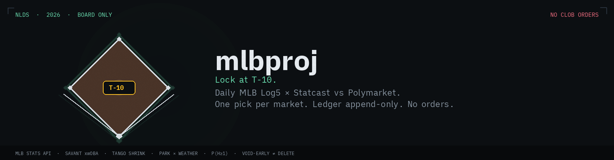

<p align="center">
  
</p>

<p align="center">
  <strong>Lock at T-10.</strong> Proyecciones diarias MLB · Log5 × Statcast · momio Polymarket.<br>
  Un pick por mercado. Ledger append-only. Cero órdenes.
</p>

<p align="center">
  
  
  
</p>

---

Esto no es un dump de DFS 2017, ni un clasificador Beat-the-Streak, ni un bot que dispara al CLOB. Es un board de investigación: el modelo habla, Polymarket cotiza, y **el take se congela diez minutos antes del `gameDate` de MLB**.

| El libro | mlbproj |
|---|---|
| Lista ambos lados del moneyline | Un lado. El otro no existe en el board |
| Lock cuando el juego está `Scheduled` | Lock en la ventana `[start−10min, start)` |
| Reescribe el pick si el modelo se mueve | Payload locked. Evalúa o `void-early` |
| Confidence = “va a pasar” | Confidence = calidad de muestra (PA, BF, xwOBA, splits) |

Si abres el dashboard a las 10am sobre un night game, **no hay lock**. Eso no es un bug.

## Modelo (un batter, un juego)

1. Rates de temporada vs la mano que va a ver, encogidos a liga (Tango / Marcel).
2. Blend de recencia 21 días, ponderado por sample.
3. Blend Statcast expected (más peso cuando el PA es flaco).
4. Log5 vs el split del starter (también shrunk).
5. Park × weather sobre extra-base / HR.
6. PA por slot de lineup → conteos; R/RBI del run environment.

Pitchers: mix de platoon del lineup posteado, IP esperadas por rol, FIP de eventos proyectados. `P(H≥1)` y `P(HR≥1)` binomiales; intervalo 80% Bernoulli.

Feeds vivos: MLB Stats API (`hydrate=probablePitcher,lineups,weather,venue` + `sitCodes=vl,vr`) y Baseball Savant `expected_statistics`. Nada de MySQL, nada de leaderboards FanGraphs como producto.

## Polymarket

Slug de juego, no `tag_id`. El tag de temporada (WS / MVP) no es este board.

```
GET https://gamma-api.polymarket.com/events?slug=mlb-{away}-{home}-{YYYY-MM-DD}
```

Mercados: ML, total, spread, 1ra entrada. El tablero solo muestra el lado que el modelo se inclina a ganar (shrunk `≥0.52`), con foquito verde. No hay filtro de edge contra Poly: da igual si el momio está arriba o abajo. ML además pide que las carreras de los dos equipos se separen por `≥0.30`. El total no se toma si μ está a menos de 1 carrera del prior 8.6. La 1ra usa los dos abridores contra el top 3; si falta un abridor de verdad, no hay precio. `core` no es apuesta y no se lockea.

Al Final, el linescore de MLB liquida una sola vez. INSERT only. Un segundo grade es no-op. Triggers abortan `UPDATE`/`DELETE` en `picks`, `settled` y `ticks`. Un lock fuera de T-10 se queda en disco como `void-early` y no cuenta en hit rate / PnL. Borrarlo para “limpiar” el eval rompe el contrato.

Foquito `inputs` por juego: verde = lineup 9+9 + ambos SP + weather observado. Ámbar = falta algo. Rojo = nada posteado. Hover = lista. No es el reloj de lock.

## Correr

```bash
uv sync
uv run python -m unittest
uv run python -m mlbproj.web --host 127.0.0.1 --port 8765
```

```
GET /api/health
GET /api/projections?date=YYYY-MM-DD
GET /api/history
```

Bind explícito. No escuches en `0.0.0.0` si el board vive en una máquina de casa. Unit de ejemplo: [`mlbproj.service`](mlbproj.service).

`data/*.sqlite` (y WAL/SHM) están gitignored. El ledger no es source.

## Honestidad

Un juego de MLB es ruido. MAE típico de hits ~0.9–1.1 incluso en sistemas públicos decentes. Los intervalos no son magia. Este repo no promete edge persistente; el ledger existe para ver dónde se rompe.

MIT. 2026.
